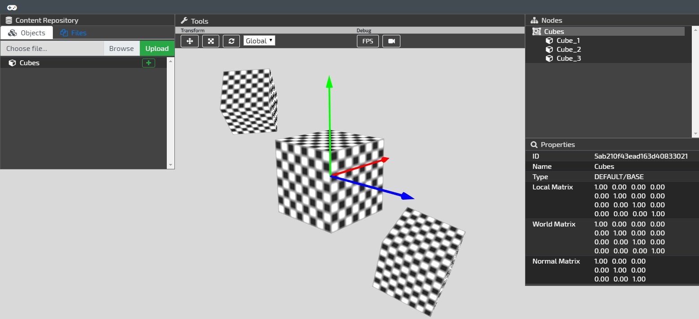

# era-engine
Era is a prototype web application for rendering, uploading, and manipulating 3D models.
This repository contains the code for both the frontend and the backend.

This project is still very early in development, so some features are incomplete or expected to change.



**Table of Contents**
- [Features](#features)
- [Usage](#usage)
- [Notes: Client](#notes-client)
  - [Commands](#commands)
  - [Configuration](#configuration)
- [Notes: Server](#notes-server)
  - [Commands](#commands-1)
  - [Configuration](#configuration-1)
  - [API](#api)
    - [Scene Nodes](#scene-nodes)
    - [Files](#files)
    - [Objects](#objects)

## Features
- Supports upload of objects and upload/download of files
- Custom WebGL engine code with dynamic shader support
- Support for local and global transformations (translate, scale, rotate)
- Auto-generated bounding boxes for objects allowing for mouse picking

## Usage
*This section is still under development*

Because the UI does not yet support deletion, data must be deleted by entering the following in a MongoDB shell:
```
> use app
> db.sceneNodes.deleteMany({})
> db.files.deleteMany({})
```

## Notes: Client
The `client` directory contains all the frontend code for the project. The major technologies used for the client
include React, Redux, Webpack, and WebGL. It is broken up into the following major components:
- `interface`: Mainly React/Redux code for managing the UI and sychronizing it with the server
- `engine`: WebGL engine code - handles important tasks such as rendering and object transformation
- `common`: Contains functionality shared by other components and maps between `interface` and `engine` data models

### Commands
Run these commands from the `client` directory:
- `npm run dev`: Runs the development version of the client (accessible at `http://localhost:8080/dist`)
- `npm run prod`: Runs the production version of the client (accessible at `http://localhost:8080/dist`)
- `npm test`: Runs the unit tests with [Karma](https://karma-runner.github.io/2.0/index.html) (Google Chrome required)

### Configuration
The client configuration file is located at `client/main/config.js` and defines the URL of the server to
communicate with (default is `http://localhost:3000`).

## Notes: Server
The `server` directory contains all the backend code for the project. The server is a Node.js/Express application written
in ES6-style JavaScript and some TypeScript.

### Commands
Run these commands from the `server` directory:
- `npm run init`: Starts the server
  - Requires connection to `mongodb://localhost/app`
- `npm start`: Starts the server and restarts it whenever server-side code is modified
  - Requires connection to `mongodb://localhost/app`
- `npm test`: Runs the integration tests
  - Requires connection to `mongodb://localhost/test`

### Configuration
The server configuration file is located at `server/main/config.js` and allows modification of the following values:
- `port`: Port the server will run on
  - Default is `3000` for the main application, `3001` for integration tests
- `database`: MongoDB URI the server will use
  - Default is `mongodb://localhost/app` for the main application, `mongodb://localhost/test` for integration tests

### API
The following is high-level overview of the REST API provided by the server. All request and response bodies are
content type `application/json` except where noted.
#### Scene Nodes
Scene nodes represent objects, lights, and other components in the scene. Each node has a path component that
allows it to be arranged into a hierarchical "scene graph", a data structure that enables grouping and the
positioning of nodes relative to other nodes.
- GET `/scene-nodes`: Returns an array of all scene nodes
- GET `/scene-nodes?pathRegex={regex}`: Returns all scene nodes with paths matching the specified `regex`
- GET `/scene-nodes/{id}`: Returns the scene node with the given `id`
- POST `/scene-nodes`: Given a valid scene node object in the POST body, saves the scene node to the database
- DELETE `/scene-nodes`: Deletes all scene nodes
- DELETE `/scene-nodes?pathRegex={regex}`: Deletes all scene nodes with paths matching the specified `regex`
#### Files
Both file metadata and file contents are stored in the database. While Era supports the upload and download
of any file type, files are typically textures that are automatically uploaded when a user uploads a
new object.
- GET `/files/metadata`: Returns an array of all file metadata
- GET `/files/{id}/metadata`: Returns the metadata of the file with the given `id`
- GET `/files/{id}/content`: Returns the contents of the file with the given `id`
  - Response content type: `application/octet-stream`
- POST `/files`: Saves a new file to the database
  - Request content type: `multipart/form-data`
  - Required form parameter `file`: The file to upload
#### Objects
Objects are the 3D models that are uploaded and manipulated by users. Each object is represented as a group
of scene nodes and the associated file (texture) data. Users can create new objects by uploading a zip
archive containing an [assimp2json](https://github.com/acgessler/assimp2json)-formatted JSON file and all
the textures used by the object.
- POST `/objects`: Given a valid object zip archive, creates the scene nodes and files for the object
  - Request content type: `multipart/form-data`
  - Required form parameter `file`: Zip archive containing the JSON file and textures
  - Required form parameter `prefix`: Prefix to use when naming the scene nodes generated for the object
